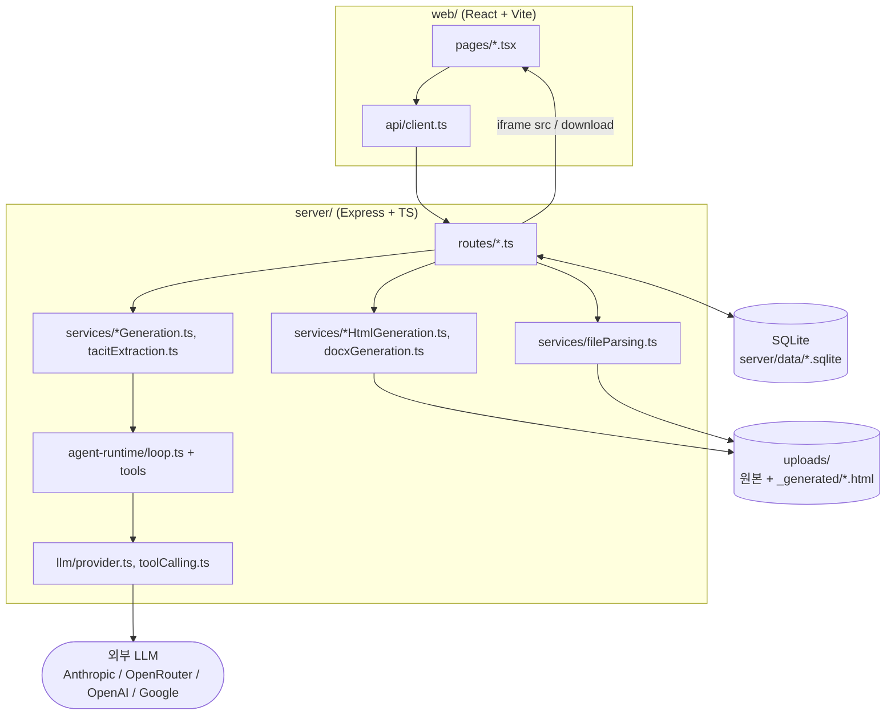
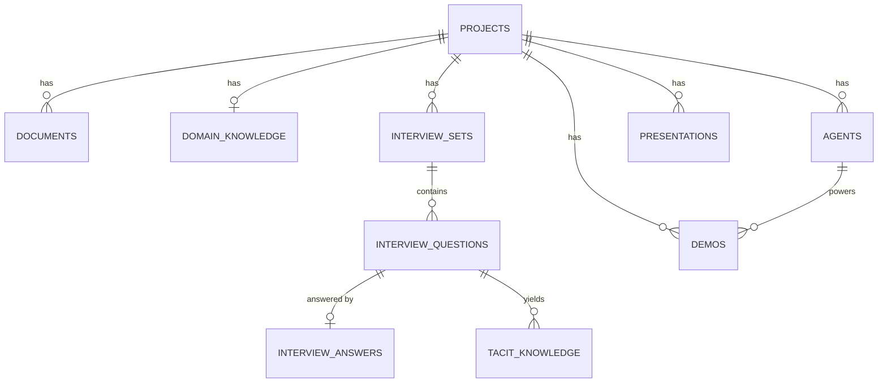
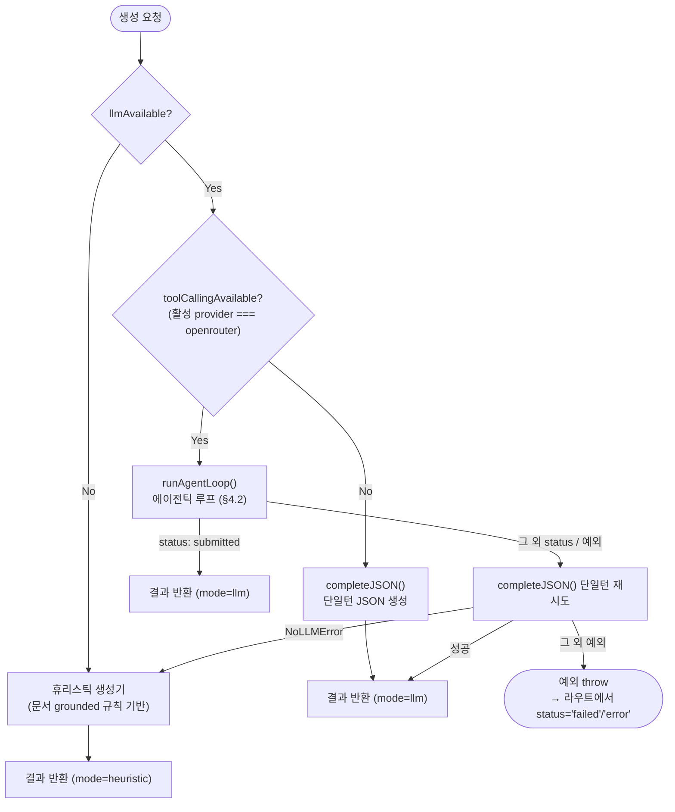
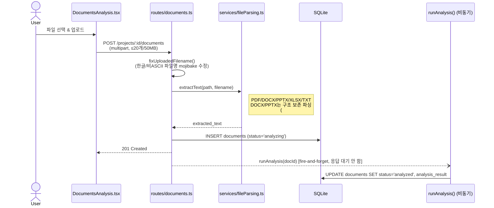
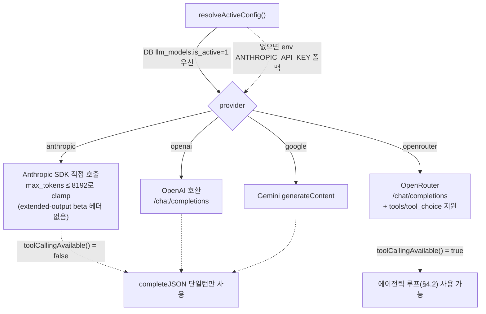
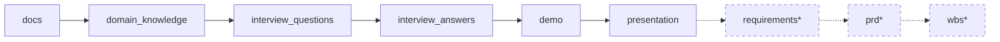

# Quest Ops 아키텍처 Flow

각 Quest 단계(스테이지)가 프론트엔드 → API 라우트 → 서비스 → agent-runtime 에이전틱 루프 →
LLM → DB/파일 순으로 어떻게 이어지는지 시퀀스 다이어그램으로 정리한 문서. 커밋 히스토리 자체의
"왜"는 `llm-wiki/`에 있고, 이 문서는 현재 코드 기준 "어떻게 동작하는가"에 집중한다.

기준 시점: 2026-08-21 (워킹 트리 기준 — Planning/Scratch/ProjectDocument tool이 7개 생성 서비스
전부에 통합된 상태 포함).

## 목차

1. [전체 파이프라인 개요](#1-전체-파이프라인-개요)
2. [시스템 구성](#2-시스템-구성)
3. [DB 스키마](#3-db-스키마)
4. [생성 서비스 공통 동작 (agent-runtime)](#4-생성-서비스-공통-동작-agent-runtime)
5. [스테이지별 상세 흐름](#5-스테이지별-상세-흐름)
6. [LLM Provider 라우팅](#6-llm-provider-라우팅)
7. [프론트엔드 라우팅/사이드바](#7-프론트엔드-라우팅사이드바)

---

## 1. 전체 파이프라인 개요

```mermaid
flowchart LR
    P([Project 생성]) --> D[문서 업로드/파싱]
    D --> DA["문서 분석 🤖"]
    DA --> DK["도메인 지식 생성 🤖"]
    DK --> IQ["인터뷰 질문 생성 🤖"]
    IQ --> IA["인터뷰 답변 저장<br/>+ 암묵지 추출 🤖"]
    IA --> TK[(Tacit Knowledge 축적)]
    TK --> AD["Agent Demo 생성 🤖"]
    AD --> PR["발표자료 생성 🤖"]
    PR --> STUB[["요구사항확정/PRD/WBS<br/>(스텁, 미구현)"]]

    style DA fill:#eef,stroke:#88f
    style DK fill:#eef,stroke:#88f
    style IQ fill:#eef,stroke:#88f
    style IA fill:#eef,stroke:#88f
    style AD fill:#eef,stroke:#88f
    style PR fill:#eef,stroke:#88f
```



🤖 표시된 5+2(문서분석·인터뷰답변매핑도 포함) = **총 7개 스테이지가 agent-runtime 에이전틱
루프**를 사용한다: `documentAnalysis`, `domainKnowledgeGeneration`, `interviewGeneration`,
`tacitExtraction`, `interviewAnswerMapping`, `agentDemoGeneration`, `pptGeneration`.

## 2. 시스템 구성



## 3. DB 스키마

| 테이블 | 주요 컬럼 |
|---|---|
| `projects` | id, name, client, owner, org, project_type, start_date, end_date, description, goal, current_quest, created_at, updated_at |
| `documents` | id, project_id, filename, file_type, size_bytes, uploader, storage_path, extracted_text, status(uploaded/analyzing/analyzed/failed), analysis_result(JSON), error_message, uploaded_at, analyzed_at |
| `domain_knowledge` | id, project_id, status(idle/generating/ready/error), content(JSON), html_path, error_message, created_at, updated_at |
| `interview_sets` | id, project_id, status, question_count, source(llm/heuristic), docx_path, error_message, created_at, updated_at |
| `interview_questions` | id, set_id, project_id, order_num, category, sub_type, question, intent, evidence(JSON), expected_insight, tacit_knowledge_type, sample_answer, edited |
| `interview_answers` | id, question_id, project_id, answer_text, note, extracted(JSON), source(manual/upload), source_document, created_at, updated_at |
| `tacit_knowledge` | id, project_id, source_question_id, type, description, evidence(JSON), confidence, created_at |
| `agents` | id, project_id, name, purpose, users(JSON), workflow(JSON), rules(JSON), human_approval(JSON), created_at |
| `demos` | id, project_id, agent_id, status, screens(JSON), scenario(JSON), html_path, error_message, created_at, updated_at |
| `presentations` | id, project_id, status, slides(JSON), file_path, html_path, error_message, created_at, updated_at |
| `llm_models` | id, name, provider, model_id, api_key, is_active, created_at, updated_at |
| `agent_run_logs` | id, run_label, status, turn_count, detail(JSON), created_at |



DB 초기화는 `server/src/db.ts`에서 import 시점에 `CREATE TABLE IF NOT EXISTS` + 컬럼 마이그레이션
(`ensureColumn`) + `sweepStaleGeneratingRows()`(비정상 종료로 `status='generating'`에 멈춘 행을
정리)로 즉시 실행된다.

---

## 4. 생성 서비스 공통 동작 (agent-runtime)

7개 생성 서비스(`documentAnalysis`, `domainKnowledgeGeneration`, `interviewGeneration`,
`tacitExtraction`, `interviewAnswerMapping`, `agentDemoGeneration`, `pptGeneration`) 모두
아래 폴백 체인과 에이전틱 루프를 동일하게 사용한다. 스테이지별 절(5절)에서는 이 공통 동작을
반복 서술하지 않고 "§4.2 루프 실행"으로만 표기한다.

### 4.1 폴백 체인



`toolCallingAvailable()`은 **활성 LLM provider가 `openrouter`일 때만 true** — Anthropic/OpenAI/
Google 직접 연동은 tool-calling(에이전틱 루프)을 지원하지 않고 항상 `completeJSON` 단일턴
경로만 탄다 (6절 참고).

### 4.2 에이전틱 루프 내부 동작 (`agent-runtime/loop.ts` `runAgentLoop`)

```mermaid
sequenceDiagram
    participant SVC as *Generation.ts (*Agentic 함수)
    participant Loop as agent-runtime/loop.ts
    participant LLM as stepWithTools()<br/>(OpenRouter)
    participant Tool as tool.execute()

    SVC->>Loop: runAgentLoop({systemPrompt, userPrompt, tools, maxTurns, maxTokensPerTurn})

    loop 턴 1..maxTurns
        Loop->>Loop: shrinkOldestToolMessages()<br/>(히스토리 > 120,000자면 오래된 tool 결과부터 축소)
        opt 1턴째 && update_plan tool 존재
            Loop->>Loop: forceTool = "update_plan"
        end
        Loop->>LLM: stepWithTools(system, messages, tools, forceTool)
        Note over LLM: fetchWithRetry(): 429/500/502/503/504<br/>또는 timeout이면 지수백오프(최대 3회)로 재시도<br/>— loop.ts는 이 결과를 신경쓰지 않음(턴 카운트 불변)
        LLM-->>Loop: {text, toolCalls, stopReason}

        alt stopReason === "error"
            Loop-->>SVC: {status: "error"}
        else 응답 텍스트 > 100,000자 (러너웨이 응답)
            Loop-->>SVC: {status: "error"}
        else toolCalls 없음
            Loop->>Loop: consecutiveNoToolCallTurns++
            alt 2회 연속
                Loop->>Loop: tryRescueTurn()
            else
                Loop->>Loop: NO_TOOL_CALL_NUDGE를<br/>user 메시지로 추가 후 다음 턴
            end
        else toolCalls 있음
            loop 각 tool call 순차 실행
                Loop->>Tool: execute(args)
                Tool-->>Loop: {content, terminate?, isValidationError?}
            end
            alt terminate === true (submit_result 검증 통과)
                Loop-->>SVC: {status: "submitted", submission}
            else isValidationError 3회 연속
                Loop->>Loop: tryRescueTurn()
            end
        end
    end

    Loop-->>SVC: {status: "exhausted" | "validation_exhausted"}
```

**구제 턴(rescue turn)**: `submit_result` tool이 있을 때만, 런 전체에서 정확히 1회 시도.
히스토리를 축소하고 `RESCUE_NUDGE`("더 이상 조사를 진행할 수 없다. 지금까지 확인한 내용을
바탕으로 최선을 다해 submit_result를 호출해 제출하라") 메시지를 추가한 뒤
`forceTool=submit_result`로 1턴 강제 실행. 실패하면 그대로 포기.

**어시스턴트 텍스트는 히스토리에 2000자로 잘려 저장**된다(`MAX_ASSISTANT_TEXT_CHARS_IN_HISTORY`)
— 그래서 긴 초안은 `write_scratch_file`(4.3)에 남겨야 다음 턴에서도 온전히 남는다.

### 4.3 agent-runtime tool 목록

| Tool | 정의 위치 | 역할 |
|---|---|---|
| `submit_result` | `tools.ts` | zod 스키마 검증 통과 시에만 `terminate:true` — 모든 실행의 유일한 종료 지점. 실패 시 에러 메시지를 반환해 자기교정 유도 |
| `update_plan` | `tools.ts` (`createPlanTool(runId)`) | 시작 전 단계 계획 기록, 1턴째 forceTool로 강제 호출됨. 호출마다 revision을 `os.tmpdir()/questops-agent-plans/{runId}.json`에 append (스크래치와 달리 런 종료 후에도 정리 안 됨) |
| `read_document_chunk` / `read_transcript_chunk` | `tools.ts` (`createReadTextChunkTool`) | 원문 텍스트를 offset부터 청크(기본 8000자)로 읽음. 문단 경계(`\n\n`) 우선 자르기 + 200자 겹침으로 이어읽기 안내. `documentAnalysis`/`interviewAnswerMapping`에서만 사용 |
| `write_scratch_file` / `read_scratch_file` / `list_scratch_files` | `scratchTools.ts` | 실행별 임시 초안 저장소(`os.tmpdir()/questops-agent-scratch/{runId}/`). 히스토리 2000자 절단을 피해 초안을 쓰고 다시 읽어 다듬을 수 있음. 런 종료 시 `cleanupScratchWorkspace(runId)`로 통째 삭제 |
| `list_project_documents` / `read_project_document_chunk` | `projectDocumentTools.ts` | 같은 프로젝트의 다른 문서를 `project_id`로 스코프해 조회(경로 접근 없음, DB 기반) |
| `runFanOutAgents` (프리미티브) | `fanOut.ts` | 여러 `AgentRunConfig`를 동시성 캡을 두고 병렬 실행. **현재 7개 서비스 중 실제 호출부는 없음** — 프리미티브만 추가된 상태 |

---

## 5. 스테이지별 상세 흐름

### 5.1 문서 업로드 & 파싱

`POST /api/projects/:id/documents` · 화면: `DocumentsAnalysis.tsx`



`POST /documents/:id/reanalyze`, `DELETE /documents/:id`도 동일 라우터에 존재.

### 5.2 문서 분석 (에이전틱)

트리거: 5.1의 `runAnalysis()` (전용 엔드포인트 없음) · 화면: `DocumentsAnalysis.tsx`

```mermaid
sequenceDiagram
    participant BG as runAnalysis()
    participant SVC as services/documentAnalysis.ts
    participant Loop as agent-runtime 루프 (§4.2)
    participant DB as SQLite

    BG->>SVC: analyzeDocument(filename, text, projectId)
    alt 텍스트 20자 미만
        SVC-->>BG: 플레이스홀더 결과 ("분석 불가")
    else
        SVC->>Loop: runAgentLoop(tools=[plan, read_document_chunk,<br/>scratch×3, projectDoc×2, submit], maxTurns=8, 4096tok)
        Loop-->>SVC: submitted | 실패(§4.1 폴백 체인 진입)
    end
    SVC-->>BG: {analysis, mode}
    BG->>DB: UPDATE documents SET status='analyzed', analysis_result
```

### 5.3 도메인 지식 생성

`POST /api/projects/:id/domain-knowledge/generate` · 화면: `DomainKnowledge.tsx`

```mermaid
sequenceDiagram
    participant FE as DomainKnowledge.tsx
    participant API as routes/domainKnowledge.ts
    participant DB as SQLite
    participant SVC as services/domainKnowledgeGeneration.ts
    participant Loop as agent-runtime 루프 (§4.2)
    participant HTML as renderDomainKnowledgeHtml()
    participant FS as uploads/_generated/

    FE->>API: POST /projects/:id/domain-knowledge/generate
    API->>DB: INSERT domain_knowledge (status='generating')
    API->>DB: SELECT documents WHERE status='analyzed'
    API->>SVC: generateDomainKnowledge({projectId, projectName, ..., analyses})
    SVC->>Loop: runAgentLoop(tools=[plan, scratch×3, projectDoc×2, submit], maxTurns=8, 8000tok)
    Loop-->>SVC: submitted | 실패(§4.1)
    SVC-->>API: {result, mode}
    API->>HTML: renderDomainKnowledgeHtml(result)
    HTML-->>API: self-contained HTML
    API->>FS: write domain_knowledge_{id}.html
    API->>DB: UPDATE domain_knowledge SET status='ready', content, html_path
    API-->>FE: 201

    FE->>API: GET /domain-knowledge/:id/html (iframe src)
    API-->>FE: HTML 스트림
    FE->>API: GET /domain-knowledge/:id/download
    API-->>FE: HTML 파일 다운로드
```

`GET /projects/:id/domain-knowledge/eligibility`(생성 가능 여부), `GET /projects/:id/domain-knowledge`(현재 상태 조회)도 동일 라우터에 존재.

### 5.4 인터뷰 질문 생성

`POST /api/projects/:id/interview/generate` · 화면: `InterviewQuestionnaire.tsx`

```mermaid
sequenceDiagram
    participant FE as InterviewQuestionnaire.tsx
    participant API as routes/interview.ts
    participant DB as SQLite
    participant FX as services/factExtraction.ts
    participant SVC as services/interviewGeneration.ts
    participant Loop as agent-runtime 루프 (§4.2)
    participant DOCX as services/docxGeneration.ts

    FE->>API: POST /projects/:id/interview/generate
    API->>DB: 분석완료 문서 확인<br/>(분석중이면 409, 0건이면 409)
    API->>DB: INSERT interview_sets (status='generating')
    API->>FX: buildGroundedFacts(docs)
    FX-->>API: GroundedFact[] (business rule/decision point/exception 등)
    API->>SVC: generateInterviewQuestions(summary, docs, projectId)
    SVC->>Loop: runAgentLoop(tools=[plan, scratch×3, projectDoc×2, submit], maxTurns=6, 8000tok)
    Loop-->>SVC: submitted | 실패(§4.1)
    SVC-->>API: {questions, mode}
    alt questions.length === 0
        API->>DB: UPDATE interview_sets SET status='error'
        API-->>FE: 422
    else
        API->>DB: bulk INSERT interview_questions (evidence 포함)
        API->>DB: UPDATE interview_sets SET status='ready'
        API->>DOCX: buildDocxForSet(setId)
        DOCX-->>API: docx_path
        API->>DB: UPDATE interview_sets SET docx_path
        API-->>FE: 201
    end
```

질문 편집(`PATCH /interview/questions/:id`)/추가/삭제 시마다 `buildDocxForSet`이 재호출되어
DOCX가 재생성된다.

### 5.5 인터뷰 답변 저장 + 암묵지 추출

`POST /api/interview/questions/:id/answer` · 화면: `InterviewAnswers.tsx`

```mermaid
sequenceDiagram
    participant FE as InterviewAnswers.tsx
    participant API as routes/interview.ts<br/>saveAnswerForQuestion()
    participant SVC as services/tacitExtraction.ts
    participant Loop as agent-runtime 루프 (§4.2)
    participant DB as SQLite

    FE->>API: POST /interview/questions/:id/answer {answerText}
    API->>SVC: extractInsightsFromAnswer(question, answerText, projectId)
    SVC->>Loop: runAgentLoop(tools=[plan, scratch×3, projectDoc×2, submit], maxTurns=5, 2048tok)
    Loop-->>SVC: submitted | 실패(§4.1)
    SVC-->>API: {insights, mode}
    API->>DB: upsert interview_answers (extracted=insights)
    API->>DB: DELETE tacit_knowledge WHERE source_question_id=?
    loop 7개 버킷(explicitRule/tacitRule/exception/<br/>decisionCriteria/riskSignal/workaround/constraint)
        API->>DB: INSERT tacit_knowledge<br/>(confidence: llm=0.85 / heuristic=0.55)
    end
    API-->>FE: 200
```

`saveAnswerForQuestion()`은 라우트 파일 안의 공용 헬퍼로, 5.6(파일 업로드 매핑)에서도 매핑된
답변마다 그대로 재호출된다.

### 5.6 인터뷰 답변 파일 업로드 + 매핑

`POST /api/projects/:id/interview/answers/upload` · 화면: `InterviewAnswers.tsx`

```mermaid
sequenceDiagram
    participant FE as InterviewAnswers.tsx
    participant API as routes/interview.ts
    participant FP as services/fileParsing.ts
    participant SVC as services/interviewAnswerMapping.ts
    participant Loop as agent-runtime 루프 (§4.2)
    participant Save as saveAnswerForQuestion() (§5.5)

    FE->>API: POST /projects/:id/interview/answers/upload<br/>(multipart, ≤30MB)
    API->>DB: 최신 interview_sets 확인 (없으면 409)
    API->>FP: extractText() (녹취록/회의록, 20자 미만이면 422)
    API->>SVC: mapTranscriptToAnswers(transcript, questions, projectId)
    SVC->>Loop: runAgentLoop(tools=[plan, read_transcript_chunk,<br/>scratch×3, projectDoc×2, submit], maxTurns=8, 4096tok)
    Loop-->>SVC: submitted | 실패(§4.1)
    SVC-->>API: MappedAnswer[] (실제로 다뤄진 질문만)
    loop 매핑된 답변마다
        API->>Save: saveAnswerForQuestion(questionId, answerText, ...)
        Note right of Save: §5.5 시퀀스 재사용<br/>(tacitExtraction 에이전트가 질문 수만큼 재호출됨)
    end
    API-->>FE: {matched: N}
```

### 5.7 Agent Demo 생성

`POST /api/projects/:id/demo/generate` · 화면: `DemoBuilder.tsx`

```mermaid
sequenceDiagram
    participant FE as DemoBuilder.tsx
    participant API as routes/demo.ts
    participant DB as SQLite
    participant SVC as services/agentDemoGeneration.ts
    participant Loop as agent-runtime 루프 (§4.2)
    participant HTML as renderDemoHtml()
    participant FS as uploads/_generated/

    FE->>API: POST /projects/:id/demo/generate
    API->>DB: INSERT demos (status='generating')
    API->>DB: 분석문서 + qaPairs(질문×답변 join)<br/>+ tacit_knowledge(type, description) 조회
    API->>SVC: generateAgentDemo({projectId, projectName, ...})
    SVC->>Loop: runAgentLoop(tools=[plan, scratch×3, projectDoc×2, submit], maxTurns=8, 8000tok)
    Loop-->>SVC: submitted | 실패(§4.1)
    SVC-->>API: {result(agentConcept+screens+scenario), mode}
    API->>DB: INSERT agents (agent concept)
    API->>HTML: renderDemoHtml(result)
    HTML-->>API: self-contained HTML
    API->>FS: write demo_{id}.html
    API->>DB: UPDATE demos SET status='ready', screens, scenario, html_path
    API-->>FE: 201

    FE->>API: GET /demo/:id/html (iframe) · /demo/:id/download
    API-->>FE: HTML 스트림 / 다운로드
```

### 5.8 발표자료 생성

`POST /api/projects/:id/presentation/generate` · 화면: `PresentationBuilder.tsx`

```mermaid
sequenceDiagram
    participant FE as PresentationBuilder.tsx
    participant API as routes/presentation.ts
    participant DB as SQLite
    participant SVC as services/pptGeneration.ts
    participant Loop as agent-runtime 루프 (§4.2)
    participant HTML as renderPresentationHtml()
    participant FS as uploads/_generated/

    FE->>API: POST /projects/:id/presentation/generate
    API->>DB: 분석문서 + tacit_knowledge<br/>+ 최신 demos/agents(있으면 concept·screens·scenario 포함)
    API->>SVC: generatePresentationSlides({projectId, ...})
    SVC->>Loop: runAgentLoop(tools=[plan, scratch×3, projectDoc×2, submit], maxTurns=6)
    Loop-->>SVC: submitted | 실패(§4.1)
    SVC-->>API: {slides, mode}
    API->>HTML: renderPresentationHtml(slides)
    HTML-->>API: self-contained HTML (방향키로 넘기는 슬라이드 뷰어)
    API->>FS: write presentation_{id}.html
    API->>DB: UPDATE presentations SET status='ready', slides, html_path
    API-->>FE: 201

    FE->>API: GET /presentation/:id/html (iframe) · /presentation/:id/download
    API-->>FE: HTML 스트림 / 다운로드
```

### 스테이지별 agent-runtime 설정 요약

| 서비스 | 트리거 | 전용 tool | maxTurns | maxTokensPerTurn |
|---|---|---|---|---|
| `documentAnalysis` | 문서 업로드/재분석 시 자동 | `read_document_chunk` | 8 | 4096 |
| `domainKnowledgeGeneration` | 도메인 지식 생성 요청 | – | 8 | 8000 |
| `interviewGeneration` | 인터뷰 질의서 생성 요청 | – | 6 | 8000 |
| `tacitExtraction` | 답변 저장/매핑 시마다 | – | 5 | 2048 |
| `interviewAnswerMapping` | 답변 파일 업로드 시 | `read_transcript_chunk` | 8 | 4096 |
| `agentDemoGeneration` | Demo 생성 요청 | – | 8 | 8000 |
| `pptGeneration` | 발표자료 생성 요청 | – | 6 | (기본값 4096) |

"–"인 서비스도 `plan`(update_plan) + `scratch×3`(write/read/list_scratch_file) +
`projectDoc×2`(list/read_project_document) + `submit`(submit_result)는 공통으로 사용한다 (§4.3).

---

## 6. LLM Provider 라우팅



- `llmAvailable()` = `resolveActiveConfig() !== null` — 매 호출마다 재조회하므로 `/settings`에서
  모델을 전환해도 서버 재시작이 필요 없다.
- `completeJSON()`: `completeText()` 결과에서 코드펜스 제거 → 첫 `{`/`[`부터 파싱 → 실패 시
  `repairTruncatedJson()`(열린 string/object/array를 닫는 방식)으로 1회 복구 시도.
- 모든 raw fetch는 `fetchWithTimeout()`으로 감싸 `LLM_REQUEST_TIMEOUT_MS = 120,000ms` 타임아웃 적용.
- `stepWithTools()`(에이전틱 전용)는 provider가 `openrouter`가 아니면 즉시 throw — 4개 provider
  중 tool-calling 루프를 지원하는 건 OpenRouter뿐이다.

---

## 7. 프론트엔드 라우팅/사이드바

| URL | 컴포넌트 |
|---|---|
| `/` | `ProjectList` |
| `/settings` | `Settings` |
| `/projects/new` | `ProjectCreate` |
| `/projects/:id` (index) | `Dashboard` |
| `/projects/:id/docs` | `DocumentsAnalysis` |
| `/projects/:id/domain-knowledge` | `DomainKnowledge` |
| `/projects/:id/interview` | `InterviewQuestionnaire` |
| `/projects/:id/interview/answers` | `InterviewAnswers` |
| `/projects/:id/demo` | `DemoBuilder` |
| `/projects/:id/presentation` | `PresentationBuilder` |
| `/projects/:id/requirements`, `/prd`, `/wbs` | `StubStage` (미구현 스텁) |

`ProjectLayout`이 `/projects/:id/*`를 감싸며 `QuestSidebar`를 렌더링한다. 사이드바 네비 순서는
서버가 내려주는 `project.progress.steps`(`QuestStepId[]`) 순서를 그대로 따른다:



(점선 = 스텁 단계, 실제 기능 없음). 사이드바 하단에는 이 흐름과 별개로 "대시보드"
(`/projects/:id` index) 링크가 고정 노출된다.

프론트 API 호출은 전부 `web/src/api/client.ts`의 `api.*` 헬퍼를 통하며, 페이지에서 직접
`fetch`를 호출하는 곳은 없다.

---

## 참고

- 각 결정의 "왜"와 시기별 변경 이력은 [`llm-wiki/`](../llm-wiki/) 참고.
- Phase 1/2 상세 설계 근거는 `docs/superpowers/specs/`, 구현 태스크 분해는
  `docs/superpowers/plans/` 참고.
